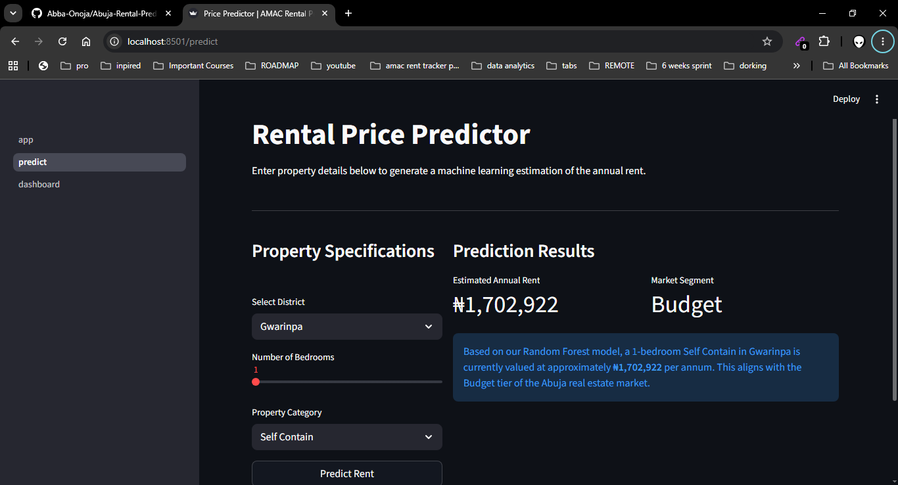
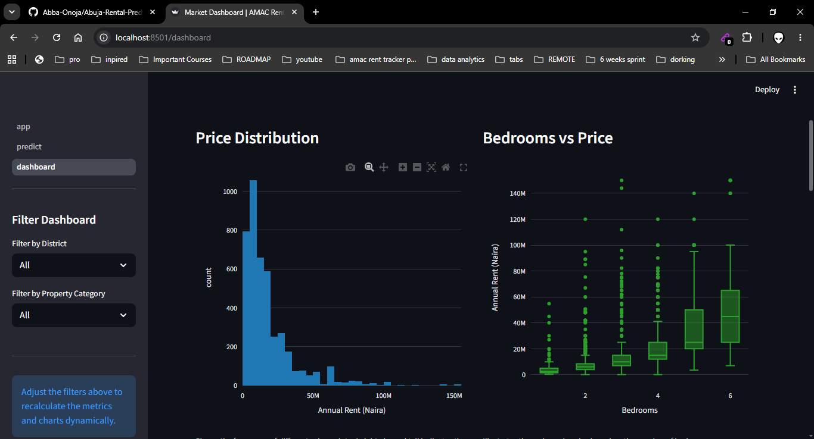

# Abuja Rental Market Prediction

[](https://www.python.org/)
[](https://streamlit.io/)
[](https://pandas.pydata.org/)
[](https://scikit-learn.org/)
[](https://www.crummy.com/software/BeautifulSoup/)

<!-- Replace with actual demo GIF -->
> 📸 **Screenshot / GIF placeholder** — add `screenshots/demo.gif`.

### Live Demo: [Abuja Rental Market Prediction](#) *(placeholder)*

> ⚠️ **Note:** First load may take 15–30 seconds as the app wakes up from inactivity (free tier). Refresh if needed!

This project is an end-to-end rental market analytics and price prediction tool for Abuja Municipal Area Council(AMAC), the high-demand political and economic hub of Nigeria's capital city. Renters, investors, and property professionals can explore median rent prices across Abuja Municipal Area Council(AMAC) districts, discover pricing patterns by property type and bedroom count, and get data-driven rent estimates through a trained machine learning model all from a single interactive Streamlit dashboard.

---

## 🔍 Overview

- A full-stack data science pipeline that scrapes live rental listings from Nigerian property platforms, cleans and structures the data, and serves both exploratory analytics and rent predictions through a multi-page Streamlit app.
- Useful for renters benchmarking fair market value, investors tracking AMAC'S district level pricing dynamics, and property professionals who need quick evidence-based rent estimates.

Built as a portfolio project to demonstrate real-world web scraping, data cleaning, feature engineering, and machine learning skills using Nigerian property market data. The project takes raw, messy listing data all the way through to an interactive prediction interface.

---

## ✨ Features

- Rent price predictor — input bedrooms, districts, and property type to get an estimated annual rent
- Interactive EDA dashboard with price distributions, district comparisons, and bedroom-count breakdowns
- Market insights page highlighting the most expensive and most affordable areas within AMAC
- Feature importance visualisation showing which variables drive AMAC'S rent prices
- Raw data browser with live search, filter, and CSV download
- End-to-end scraping pipeline targeting multiple Nigerian property listing platforms

---

## 🚀 What Makes This Project Unique

- Locally grounded — built entirely on live Abuja listing data, not a generic public dataset
- Full pipeline ownership — from HTTP request and HTML parse to trained model and deployed app, every step is custom-built
- Interprets the Nigerian market specifically — district-level encoding, Naira-denominated outputs, and FCT-aware premium flags (Maitama, Asokoro, Wuse II)
- Produces actionable outputs, not just visualisations — the prediction page gives a concrete rent estimate plus an uncertainty range

---

## 🧱 Tech Stack

**App & Presentation**
- Streamlit (multi-page app)
- Plotly (interactive charts)

**Data Collection**
- requests
- BeautifulSoup4
- re (regex)

**Data Processing & Modelling**
- pandas
- NumPy
- scikit-learn (Random Forest, Linear Regression, preprocessing)
- pickle (model serialisation)

**Storage**
- CSV (raw listings, cleaned listings, model outputs)

**Environment**
- python-dotenv

---

## 🏗️ Architecture

- A scraper module uses `requests` and `BeautifulSoup` to pull rental listings from property platforms, with `regex` handling field extraction from unstructured text
- Raw listings are written to `data/raw_listings.csv` immediately after scraping, preserving the original data before any transformation
- A cleaning and feature-engineering pipeline reads the raw CSV, imputes missing values, encodes categorical fields, and writes `data/clean_listings.csv`
- A training script reads the clean data, builds a Random Forest regressor, evaluates it on a held-out test set, and serialises the best model to `model/model.pkl`
- The Streamlit app loads the clean CSV and the pickled model at startup and serves four pages: price predictor, EDA, market insights, and raw data browser

---

## 📁 Project Structure

```
Abuja-Rental-Market-Prediction-With-Streamlit/
├── scraper/
│   ├── scraper.py          # requests + BeautifulSoup pipeline
│   └── parser.py           # regex field extraction helpers
│
├── processing/
│   ├── clean.py            # null handling, type casting, deduplication
│   └── features.py         # feature engineering + train/test split
│
├── model/
│   ├── train.py            # model training + evaluation
│   ├── evaluate.py         # MAE, RMSE, R² reporting + plots
│   └── model.pkl           # serialised model artifact
│
├── data/
│   ├── raw_listings.csv    # scraped verbatim (never overwritten)
│   └── clean_listings.csv  # typed, deduped, feature-engineered
│
├── app/
│   ├── main.py             # Streamlit entry point + shared loader
│   └── pages/
│       ├── 1_predict.py    # rent price estimator
│       ├── 2_eda.py        # exploratory data analysis
│       ├── 3_insights.py   # market insights + feature importance
│       └── 4_data.py       # raw data browser + CSV download
│
├── notebooks/
│   └── exploration.ipynb   # EDA scratch pad
│
├── screenshots/
│   └── demo.gif            # placeholder — add before publishing
│
├── requirements.txt
├── .env.example            # template for environment variables
├── .gitignore
├── DATA.md                 # data source and field documentation
├── LICENSE
└── README.md
```

---

## ⚙️ Installation

### 1. Clone the repository

```bash
git clone https://github.com/Abba-Onoja/Abuja-Rental-Prediction-With-Streamlit.git
cd Abuja-Rental-Prediction-With-Streamlit
```

### 2. Install dependencies

```bash
pip install -r requirements.txt
```

### 3. Run the scraper

```bash
python scraper/scraper.py
```

This writes `data/raw/raw_listings_npc.csv`. Set `MAX_PAGES` inside the script to control how many listing pages to collect.

### 4. Process the data and train the model

```bash
python processing/clean.py
python processing/features.py
python model/train.py
```

### 5. Launch the Streamlit app

```bash
streamlit run app/main.py
```

The app will open at `http://localhost:8501`.

---

## 📊 Data & Model Details

For full data source and field documentation, see [DATA.md](./DATA.md).

- Listings scraped from PropertyPro.ng, Jiji.ng, and NigeriaPropertyCentre.com
- Fields collected: price (₦/year), location (district + area), bedrooms, bathrooms, property type, listing URL, scraped timestamp
- Key engineered features: `price_per_bedroom`, `bath_to_bed_ratio`, `is_premium_district` (binary flag for Maitama, Asokoro, Wuse), district label encoding, property type one-hot encoding, log-transformed target
- Baseline model: Linear Regression
- Core model: Random Forest Regressor (200 estimators, depth 10)
- Evaluation: MAE, RMSE, and R² reported on an 80/20 stratified split
- Model outputs are back-transformed from log scale to Naira before display

> 📌 **Metrics placeholder** — update the table below after training on your collected data.

| Model | MAE (₦) | RMSE (₦) | R² |
|---|---|---|---|
| Linear Regression | — | — | — |
| Random Forest | — | — | — |

---

## 📸 Screenshots

> 📸 **Placeholder**.

### Price Predictor



### EDA Dashboard



### Market Insights


### Raw Data Browser


---

## 💡 Future Improvements

- Add scraping scheduler (e.g. APScheduler) to refresh data weekly without manual runs
- Integrate an AMAC district choropleth map using Folium or Plotly Mapbox
- Experiment with XGBoost and hyperparameter tuning via GridSearchCV
- Export a PDF rent benchmark report directly from the Streamlit app
- Add a listing anomaly detector to flag prices that deviate significantly from the district median

---

## 📌 Notes

I built this as a portfolio project to demonstrate end-to-end data science skills on a locally relevant problem — the Nigerian property market. Everything from the scraper to the prediction interface is built from scratch, without pre-packaged datasets. The goal was to show the full lifecycle: collecting raw data, cleaning it, engineering meaningful features, training and evaluating a model, and making the outputs accessible through an interactive app.

---

## 📜 License

This project is licensed under the MIT License. You are free to use, modify, and distribute this code for personal or commercial purposes, provided you include the original copyright notice.

See the [LICENSE](./LICENSE) file for full details.
