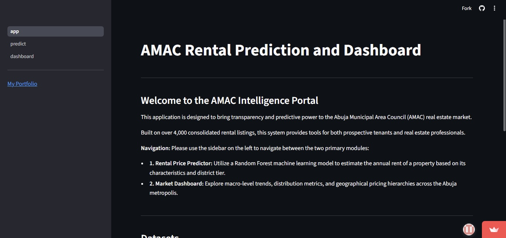
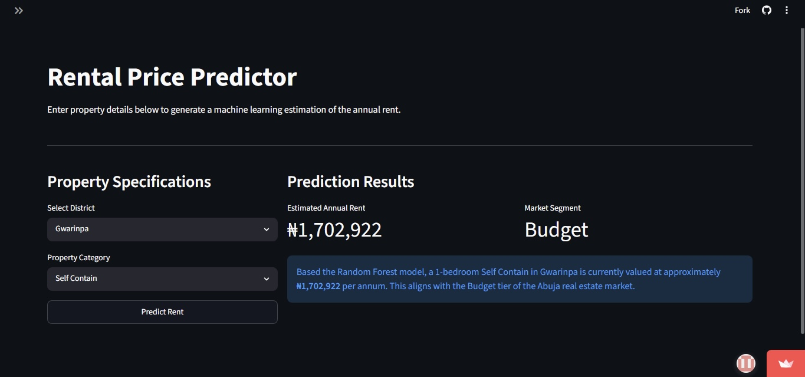
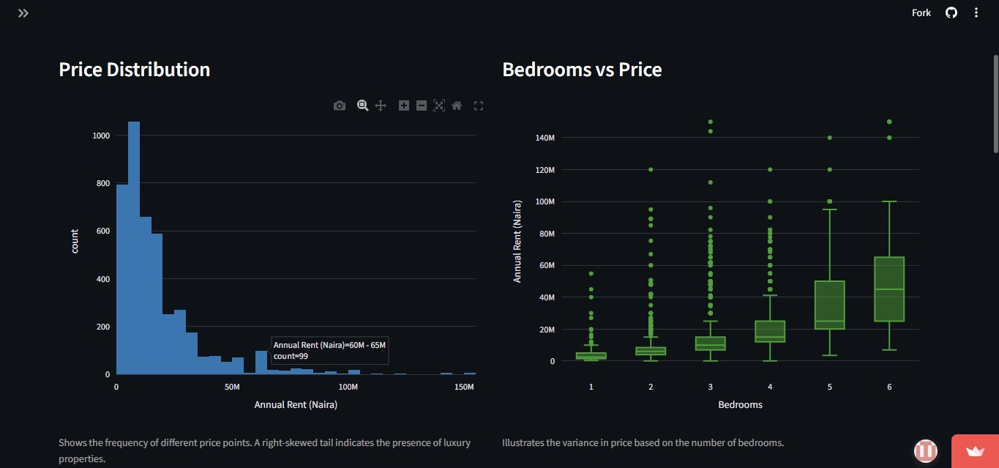

# Abuja Rental Market Prediction

[](https://www.python.org/)
[](https://streamlit.io/)
[](https://pandas.pydata.org/)
[](https://scikit-learn.org/)
[](https://www.crummy.com/software/BeautifulSoup/)

## Screenshot



Link: 
> ⚠️ **Note:** First load may take 15–30 seconds as the app wakes up from inactivity (free tier). Refresh if needed!

This is an end-to-end project designed to bring transparency to the rental market in the Abuja Municipal Area Council (AMAC). It scrapes the collection of property listings from major Nigerian portals, cleans the data, and serves a Random Forest prediction model through a multipage Streamlit dashboard.

The tool allows users to estimate fair market rent based on district, property type, and bedroom count, helping to bridge the information gap for tenants and real estate professionals in Nigeria's capital.

---

## Technical Overview

* **Data Source:** Custom-built scraper targeting Jiji, PropertyPro.ng, and Nigeria Property Centre.
* **Pipeline:** Modular architecture covering scraping, cleaning, feature engineering, and model deployment.
* **Modeling:** Comparative analysis between Linear Regression (Baseline) and Random Forest (Production).
* **Deployment:** Interactive UI built with Streamlit and Plotly for real-time market intelligence.

---

## Project Structure

```text
Abuja-Rental-Prediction-with-streamlit/
├── app/
│   ├── app.py            
|   ├──abuja_rent_model.pkl
|   ├──feature_columns.pkl
|   ├──processed_abuja_rentals.csv
|   ├──abuja_rental_master_v2.csv
│   └── pages/
│       ├── 1_predict.py     
│       └── 2_dashboard.py  
|
├── data/
│   ├── master 
|   |   ├── abuja_rental_master_v2.csv
|   |   ├── abuja_rental_master.csv
|   |   └── processed_abuja_rentals.csv
│   └── processed 
|       ├── jiji_cleaned.csv
|       ├── npc_cleaned.csv
|       └── ppro_cleaned.csv
|
├── notebooks/
│   ├── clean_jiji.ipynb            
│   ├── clean_ppro.ipynb
|   ├── clean.ipynb
|   ├── eda.ipynb
|   ├── feature_engineering.ipynb
│   └── model_training.ipynb  
|
├── processing/           
│   └── aggregator.py 
|
├── scraper/
|   ├── jiji.py   # used for finding the number of pages on jiji.ng 
│   ├── scraper.py 
|   ├── scraper_ppro.py        
│   └── scraper_jiji.py                   
|
├── screenshots/
|   ├── dashboard.png 
│   ├── eda.png
│   └── predict.png
|
├── README.md
|
└── requirements.txt

```

---

## Model Performance

The project compared a standard Linear Regression baseline against a Random Forest Regressor. Random Forest proved superior by capturing non-linear relationships, such as the disproportionate price jump seen in Tier 1 districts like Maitama and Asokoro compared to satellite towns.

| Model | MAE (Log Scale) | RMSE (Log Scale) | R² Score |
| --- | --- | --- | --- |
| Linear Regression | 0.3798 | 0.5333 | 0.7174 |
| **Random Forest** | **0.3475** | **0.4901** | **0.7613** |

The Random Forest model explains **76.1%** of the variance in rental prices. Given that property value is often influenced by factors not present in web listings (e.g., finishing quality, road access, or security), this R² represents a strong predictive baseline for the AMAC market.

---

## Installation & Usage

### 1. Clone the Repository

```bash
git clone https://github.com/Abba-Onoja/Abuja-Rental-Prediction-With-Streamlit.git
cd Abuja-Rental-Prediction-With-Streamlit

```

### 2. Set Up Environment

```bash
pip install -r requirements.txt

```

### 3. Run the Application

```bash
streamlit run app/main.py

```

---
## 📸 Screenshots


### Price Predictor



### EDA Dashboard





---

## Future Imporvements

* **Choropleth Mapping:** Integrate a GeoJSON map of Abuja to visualize price heatmaps by district.
* **Automated Scraping:** Set up a GitHub Action to refresh the dataset weekly.
* **Advanced Modeling:** Experiment with Gradient Boosting (XGBoost/LightGBM) and hyperparameter tuning.

## Notes

This project was built to demonstrate a full-stack data science workflow on a locally relevant problem. All data was collected specifically for this project; no pre-existing datasets were used.

## License

MIT License. See `LICENSE` for details.